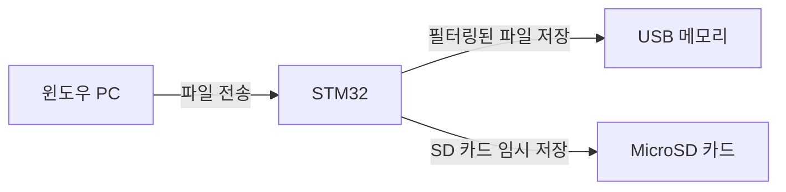

윈도우에서 파일을 USB 스틱에 저장할 때 **STM32가 직접 파일 제어와 필터링을 수행**하려면, 다음과 같은 아키텍처와 단계가 필요하다. 핵심은 **STM32를 USB 호스트로 설정**하고, **PC와 USB 메모리 사이의 중간 게이트웨이**로 동작시키는 것이다.

### 📁 **1. 시스템 구성도**


### ⚙️ **2. 구현 원리**
#### (1) **STM32의 이중 역할**
- **USB 장치 모드 (PC 연결)**:  
  STM32가 PC에 **가상 USB 드라이브**로 인식되도록 설정.  
  → PC는 이 드라이브에 파일을 복사하면, STM32의 SD 카드로 자동 저장.
- **USB 호스트 모드 (메모리 제어)**:  
  STM32가 USB 메모리를 직접 제어하며, SD 카드에서 필터링된 파일(`.hwp`, `.doc`)만 선택하여 복사.

#### (2) **필터링 자동화 프로세스**
1. **PC → STM32 가상 드라이브에 파일 복사**  
   - 사용자가 PC에서 파일을 STM32의 가상 드라이브(`F:\` 등)로 드래그 앤 드롭.
   - STM32는 이 파일을 **SD 카드에 임시 저장**.

2. **STM32의 백그라운드 필터링 작업**  
   ```c
   void background_task() {
       while (1) {
           if (files_in_sd_card()) { // SD 카드에 새 파일 존재 시
               filter_and_copy_to_usb(); // 확장자 필터링 후 USB 메모리 복사
           }
           osDelay(1000); // 1초마다 검사 (FreeRTOS 사용 시)
       }
   }
   ```

3. **필터링 로직 (`filter_and_copy_to_usb` 함수)**  
   - SD 카드의 파일 목록을 스캔 → `.hwp`, `.doc` 확장자만 선택.
   - USB 메모리로 복사 후, SD 카드의 임시 파일 삭제.

### 🔌 **3. 하드웨어 연결 예시**
| STM32 핀       | 연결 대상         | 기능                     |
|----------------|-------------------|--------------------------|
| **USB_OTG_HS** | PC (마이크로 USB) | 장치 모드 (가상 드라이브) |
| **USB_OTG_FS** | USB 메모리        | 호스트 모드 (직접 제어)   |
| **SDMMC1**     | MicroSD 카드      | 임시 저장소              |

> 💡 **주의**: STM32H750은 HS(High-Speed)와 FS(Full-Speed) USB 포트를 동시 지원.

### 🛠️ **4. 펌웨어 구현 핵심 코드**
#### (1) **USB 장치 모드 설정 (PC 인식)**
```c
// STM32CubeMX 생성 코드
USBD_Init(&hUsbDeviceHS, &MSC_Desc, DEVICE_HS);
USBD_RegisterClass(&hUsbDeviceHS, &USBD_MSC);
USBD_MSC_RegisterStorage(&hUsbDeviceHS, &USBD_Storage_Interface_fops);
```

#### (2) **USB 호스트 모드 설정 (메모리 제어)**
```c
USBH_Init(&hUsbHostFS, USBH_MSC_Class, &hUsbHostFS_Config);
USBH_RegisterDriver(&hUsbHostFS, &USBH_MSC_Driver);
USBH_Start(&hUsbHostFS);
```

#### (3) **파일 필터링 및 복사**
```c
void filter_and_copy_to_usb() {
    DIR dir;
    FILINFO file_info;
    f_opendir(&dir, "/"); // SD 카드 루트 탐색

    while (f_readdir(&dir, &file_info) == FR_OK) {
        if (file_info.fname[0] == 0) break; // 종료 조건
        
        // .hwp/.doc 파일만 선택
        if (strstr(file_info.fname, ".hwp") || 
            strstr(file_info.fname, ".doc")) {
            
            // USB 메모리로 복사
            copy_to_usb_memory(file_info.fname);
            
            // 처리 후 SD 카드 파일 삭제
            f_unlink(file_info.fname);
        }
    }
    f_closedir(&dir);
}
```

### ⚠️ **5. 사용자 경험 최적화**
- **진행 상태 표시**:  
  STM32의 LED나 UART 출력으로 필터링 진행 상황 알림.
- **자동 시작**:  
  USB 메모리 연결 시 자동 복사 시작 (USB 호스트 감지 콜백 활용).
- **에러 처리**:  
  USB 메모리 꽉 참 → PC에 오류 알림 (가상 COM 포트 활용).

### ✅ **6. 동작 시나리오**
1. 사용자가 `report.hwp`, `photo.jpg`, `data.doc`를 STM32 가상 드라이브(`F:\`)에 복사.
2. STM32는 SD 카드에 파일 저장 → 백그라운드에서 `report.hwp`, `data.doc`만 필터링.
3. 필터링된 파일이 USB 메모리(`G:\`)에 저장되고, SD 카드 파일은 삭제됨.
4. 사용자는 USB 메모리에서 **hwp/doc 파일만 확인 가능**.

### 📌 **결론**
- **가능 여부**:  
  윈도우에서 파일을 **한꺼번에 복사 → STM32가 필터링 → USB 메모리 저장** 가능.
- **필요 조건**:  
  STM32의 **이중 USB 모드 지원** + **FATFS 미들웨어 연동**.
- **추천 보드**:  
  STM32H750VBT6 (USB HS/FS 동시 지원, 480Mbps 고속 전송).

> 🔧 **구현 팁**:  
> STM32CubeMX에서 `USB_OTG_HS` (Device) + `USB_OTG_FS` (Host) + `SDMMC1` (SD 카드) 활성화 후,  
> FreeRTOS로 백그라운드 태스크를 생성해 필터링을 비동기적으로 처리하면 효율적이다.

[1] https://www.youtube.com/watch?v=52BATyJrmeg
[2] https://www.youtube.com/watch?v=pD8Lty7bP7M
[3] https://www.instructables.com/Advanced-file-copying-with-batch-files/
[4] https://www.howtogeek.com/685516/how-to-copy-files-to-a-usb-flash-drive-on-windows-10/
[5] https://www.integralmemory.com/faq1/how-do-i-copy-my-files-and-documents-to-the-usb-flash-drive/
[6] https://www.reddit.com/r/windows/comments/5rv804/copying_large_amounts_of_files_between_pcs_via/
[7] https://answers.microsoft.com/en-us/windows/forum/all/unable-to-copy-all-files-to-usb-flash-drive/3ac8d569-ae0e-4eca-8649-fea96dd6a0b3
[8] https://superuser.com/questions/1693295/fastest-way-on-windows-to-copy-38gb-of-files-to-50-usb-drives
[9] https://stackoverflow.com/questions/56053230/how-to-copy-a-file-from-a-usb-drive-to-c-drive-in-windows-10-using-a-batch-file
[10] https://superuser.com/questions/22766/how-can-i-automatically-copy-files-to-a-usb-drive-when-i-connect-it-to-my-comput
